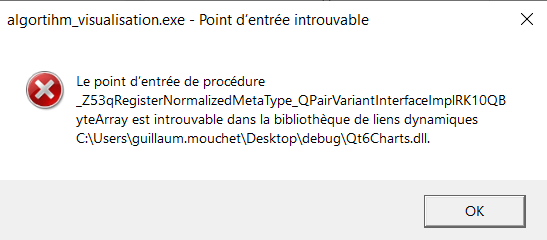

# Algorithm Visualisation

Projet réalisé durant le semestre de printemps 2022 dans le cadre du cours d'algorithmes et structures de données III. 

L'executable n'a pas pu être réalisé pour problème de point d'entrée des bibliothèques de QtCharts, pour vous faciliter le travail nous avons inclu directement "Qt6Charts.dll" à côté du ReadMe".

